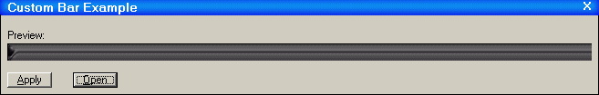



## Custom Bar Example

### Description

This is an example of how you can have a program that can have differnt skins! So you can make some website where people create and trade skins for your wesbite! Please rate my code!
 
### More Info
 

             |
---                |---
**Submitted On**   |2002-11-07 15:23:14
**By**             |[Jesse Seidel \(Dr\. Fire\)](https://github.com/Planet-Source-Code/PSCIndex/blob/master/ByAuthor/jesse-seidel-dr-fire.md)
**Level**          |Beginner
**User Rating**    |5.0 (10 globes from 2 users)
**Compatibility**  |VB 6\.0
**Category**       |[Coding Standards](https://github.com/Planet-Source-Code/PSCIndex/blob/master/ByCategory/coding-standards__1-43.md)
**World**          |[Visual Basic](https://github.com/Planet-Source-Code/PSCIndex/blob/master/ByWorld/visual-basic.md)
**Archive File**   |[Custom\_Bar1493561172002\.zip](https://github.com/Planet-Source-Code/jesse-seidel-dr-fire-custom-bar-example__1-40503/archive/master.zip)

